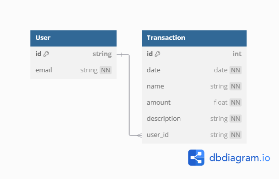

#  TallyTrail
Created by: [Md Tanjeem Haider](https://github.com/MdTanjeemHaider)

---

TallyTrail is a financial tracking system that helps users manage their income and expenses. The system features user authentication, transaction tracking, and interactive dashboards for a seamless user experience. Built with Flask and SQLite, TallyTrail combines robust backend services with a user-friendly frontend.

##### [Performance Analysis](https://pagespeed.web.dev/analysis/https-tallytrail-duckdns-org-Dashboard/3to9a6ue4u?use_original_url=true&form_factor=desktop)

---

## Table of Contents
- [Features](#features)
- [Technologies Used](#technologies-used)
- [Architecture](#architecture)
- [CI/CD Pipeline](#ci/cd-pipeline)
- [Database Schema](#database-schema)
- [Installation](#installation)
- [Contributing](#contributing)
- [License](#license)
- [Authors](#authors)

---

## Features
- **User Authentication**: Secure login and registration using Firebase Authentication.
- **Transaction Management**: Add, view, and delete transactions with a detailed record of income and expenses.
- **Dashboard**: Visualize financial data through graphs and manage transactions with a search and filter functionality.
- **Responsive Design**: Accessible on both desktop and mobile devices.
- **Secure Backend**: Data integrity ensured through Flask and SQLAlchemy.

---
## Technologies Used
- **Backend:** Python, Flask, SQLAlchemy
- **Frontend:** HTML, CSS, JavaScript
- **Authentication:** Firebase Authentication
- **Database:** SQLite
- **Testing:** Pytest
- **CI/CD:** GitHub Actions
- **Deployment**: Docker
---

## Architecture
<!-- Explanation of chosen architecture  -->
TallyTrail follows a client-server architecture with a Flask backend and a frontend built using HTML, CSS, and JavaScript. The backend is responsible for handling user authentication, transaction management. The system uses SQLite for data storage and Firebase Authentication for user authentication. The frontend interacts with the backend through API calls to display the user's financial data. 

---

## CI/CD Pipeline
- **Continuous Integration**: TallyTrail uses GitHub Actions for continuous integration. The CI pipeline runs tests on every push to the repository to ensure code quality.
- **Continuous Deployment**: The application is deployed using Docker containers in an Oracle Cloud Infrastructure Virtual Machine. The deployment pipeline is triggered on every push to the main branch.

---

## Database Schema


---

## Installation

### Prerequisites
- Python 3.12+
- Docker (optional for containerized deployment)
- Firebase project for authentication

### Steps (Local Deployment)
1. Clone the repository:
   ```bash
   git clone https://github.com/<your-repo>/TallyTrail.git
   cd TallyTrail
   ```
2. Create a virtual environment and activate it:
    ```bash
    python -m venv venv
    source venv/bin/activate  # On Windows: venv\Scripts\activate
    ```
3. Install the dependencies:
    ```bash
    pip install -r requirements.txt
    ```
4. Configure your environment variables:
    - Create a .env file in the src/ directory with the following:
    ```
    FLASK_SECRET_KEY=your_secret_key
    SQLITE_DATABASE_URI=sqlite:///TallyTrail.db
    FIREBASE_API_KEY=your_firebase_api_key
    FIREBASE_AUTH_DOMAIN=your_firebase_auth_domain
    FIREBASE_PROJECT_ID=your_firebase_project_id
    FIREBASE_STORAGE_BUCKET=your_firebase_storage_bucket
    FIREBASE_MESSAGING_SENDER_ID=your_firebase_messaging_sender_id
    FIREBASE_APP_ID=your_firebase_app_id
    ```
5. Run the application:
    ```bash
    python src/app.py
    ```
6. Access the application at `localhost:5000`.

### Steps (Containerized Deployment)
1. Clone the repository:
   ```bash
   git clone https://github.com/<your-repo>/TallyTrail.git
   cd TallyTrail
   ```

2. Build the Docker image:
    ```bash
    docker build -t tallytrail .
    ```

3. Run the Docker container:
    ```bash
    docker run -p 5000:5000 tallytrail
    ```

### Steps (Testing)
1. Run the tests:
    ```bash
    pytest
    ```
---

## Contributing
1. Fork the repository.
2. Create a new branch (`git checkout -b feature`).
3. Make changes and commit them (`git commit -am 'Add feature'`).
4. Push the branch (`git push origin feature`).
5. Create a pull request.

---
## License
This project is licensed under the GNU General Public License v3.0 - see the [LICENSE](LICENSE) file for details.
